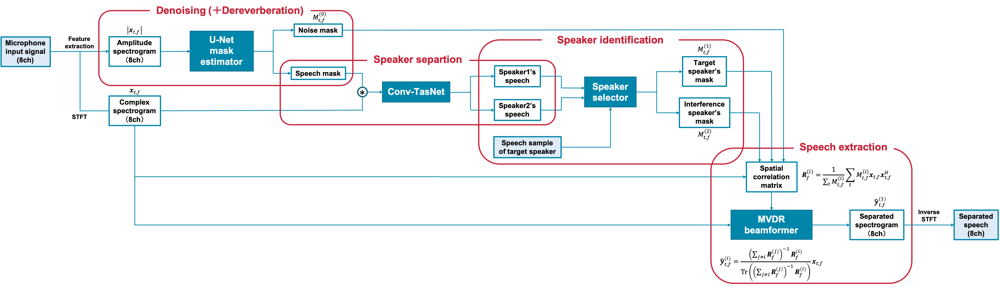

# MaskBeamformer

## Abstruct

PyTorch implementation of "Adaptation of robots to the real environment by simultaneous execution of
 dereverberation, denoising and speaker separation using neural beamformer".





## Dependencies

This code was tested on Python 3.6 with PyTorch 1.8 and torchvision 0.9.0.

```
$ pip3 install -r requirements.txt
```


## Prepare Dataset

1. Download Noisy Speech Database

   Get Noisy Speech Database at https://datashare.ed.ac.uk/handle/10283/2791.

   Please download the following.

   - `clean_testset_wav.zip`
   - `clean_trainset_28spk_wav.zip`
   - `noisy_testset_wav.zip`
   - `noisy_trainset_28spk_wav.zip`
   - `testset_txt.zip`

2. Spatialize audio by convolving RIR (Room Impulse Response)

   First, unzip zip file to desired folder.

   ```
   $ tar *.zip 
   ```

   Second, run the following command to make training dataset for U-Net mask estimator

   ```
   $ 
   ```

   


## Training U-Net mask estimator

```
$ python3 training.py
```


## Inference and evaluation

1. Download pretrained model for speaker recognition system

   This method utilizes speaker recognition system ([d-vector embeddings](https://google.github.io/speaker-id/publications/GE2E/)).

   Get pretrained model for speaker recognition system at [this GDrive link](https://drive.google.com/file/d/1YFmhmUok-W76JkrfA0fzQt3c-ZsfiwfL/view?usp=sharing).

   This model was trained with [VoxCeleb2](http://www.robots.ox.ac.uk/~vgg/data/voxceleb/vox2.html) dataset,
   where utterances are randomly fit to time length [70, 90] frames.
   Tests are done with window 80 / hop 40 and have shown equal error rate about 1%.
   Data used for test were selected from first 8 speakers of [VoxCeleb1](http://www.robots.ox.ac.uk/~vgg/data/voxceleb/vox1.html) test dataset, where 10 utterances per each speakers are randomly selected.

   **Update**: Evaluation on VoxCeleb1 selected pair showed 7.4% EER.

2. Download pretrained model for speaker separation system

   This method utilizes speaker separation system ([Conv-TasNet](https://arxiv.org/pdf/1809.07454.pdf)).

   Get pretrained model for speaker separation system at [this huggingface link](https://huggingface.co/models?filter=asteroid).

   Please download `JorisCos/ConvTasNet_Libri2Mix_sepnoisy_16k`.

3. Run

   ```
   $ python3 inference.py
   ```

   **Option**

   - `-sr` : sampling rate (Default 16000)
   - `-bl` : batch size of mask estimator and beamformer input (Default 48000)

   -  


## Online demo

1. Prepare the microphone array

   You can use TAMAGO-03 microphone array with 8 microphones.

2. Run

   Open two terminals and run following commands in each terminal (Mac or Linux).
   
   - Server

     ```
     $ python3 asr_server_julius.py
     ```
   
   - Client
   
     ```
     $ python3 RealTimeDemo.py -dm -d 0 -mg 20
     ```
   
     **Option**
   
     - `-dm` : Whether model denoises audio or not
   
     - `-d` : Input device (numeric ID or substring) (you can check ID by running following commands)
        ```
        $ python3 
        >>> import sounddevice
        >>> sounddevice.query_devices()
        ```
   
     - `-mg`: Increase microphone gain

   If you can use g++ complier on linux, open three terminals and run following commands in each terminal (Input stream speed is faster).

   - ASR server

     ```
     $ python3 asr_server_julius.py
     ```
   
   - Speech extracter interface (server & client)

     ```
     $ python3 speech_extracter_interface.py -dm -mg 20
     ```
   
   - Input stream client
   
     ```
     $ g++ mic_record_to_speech_extracter.cpp -lasound -lm -o mic_record_to_speech_extracter
     $ ./mic_record_to_speech_extracter plughw:2,0
     ```
     If you run `arecord -l` and the following is displayed, specify the argument part as `plughw:[card number],[subdevice number]` 
     ```
      card 2: TAMAGO03 [TAMAGO-03], device 0: USB Audio [USB Audio]
      Subdevices: 1/1
      Subdevice #0: subdevice #0
      ```


   


## Author

Daichi Nagano at nakazawa lab


